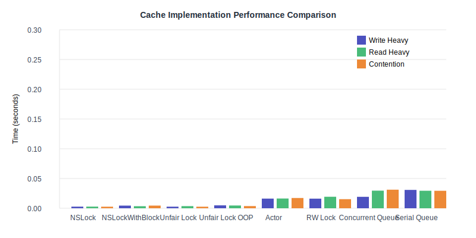
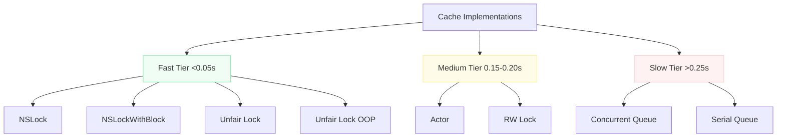
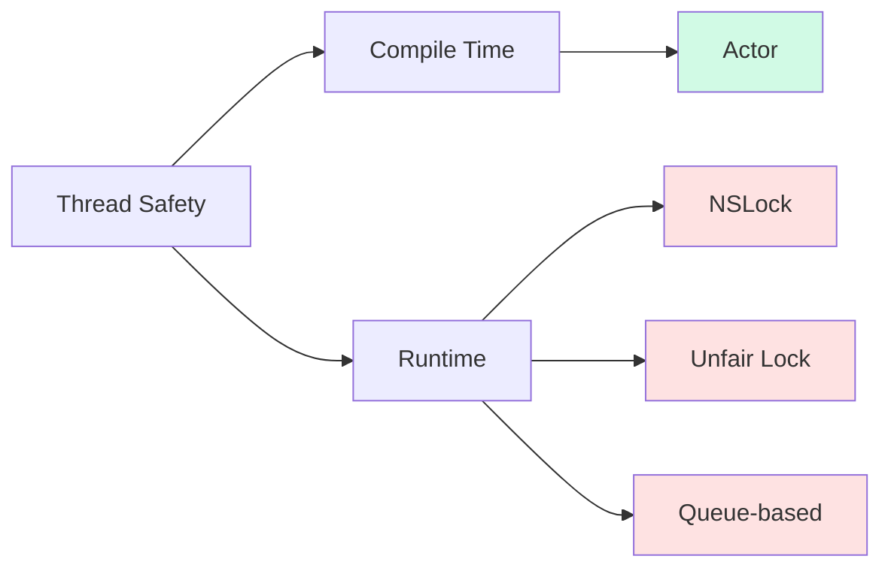

# Swift Cache Implementation Performance Analysis

A comprehensive comparison of different thread-safe cache implementations in Swift, analyzing performance characteristics across various synchronization approaches.

## Table of Contents
- [Overview](#overview)
- [Performance Analysis](#performance-analysis)
- [Implementations](#implementations)
- [Detailed Results](#detailed-results)
- [Recommendations](#recommendations)
- [Implementation Details](#implementation-details)

## Overview

This repository provides eight different implementations of a thread-safe cache in Swift, each using different synchronization mechanisms:
- NSLock
- NSLock with Block Syntax
- Unfair Lock
- Unfair Lock with OOP
- Actor-based
- Serial Queue
- Concurrent Queue
- Read-Write Lock

## Performance Analysis

### Visual Comparison


### Performance Distribution



### Performance Results

| Implementation | Write Heavy | Read Heavy | Contention | Code Complexity |
|---------------|-------------|------------|------------|-----------------|
| NSLock |  |  |  | 🟡 Medium |
| NSLockWithBlock |  |  |  | 🟢 Low |
| Unfair Lock |  |  |  | 🔴 High |
| Unfair Lock OOP |  |  |  | 🟢 Low |
| Actor |  |  |  | 🟢 Low |
| RW Lock |  |  |  | 🔴 High |
| Concurrent Queue |  |  |  | 🟡 Medium |
| Serial Queue |  |  |  | 🟢 Low |

## Implementations

### 1. NSLock Implementation
```swift
class CacheNSLock<Key: Hashable, Value> {
    private var cache: [Key: Value] = [:]
    private let lock = NSLock()
    
    func get(_ key: Key) -> Value? {
        lock.lock()
        defer { lock.unlock() }
        return cache[key]
    }
    
    func set(_ key: Key, value: Value) {
        lock.lock()
        defer { lock.unlock() }
        cache[key] = value
    }
}
```

### 2. NSLock with Block Syntax
```swift
class CacheNSLockWithBlock<Key: Hashable, Value> {
    private var cache: [Key: Value] = [:]
    private let lock = NSLock()
    
    func get(_ key: Key) -> Value? {
        lock.withLock {
            return cache[key]
        }
    }
    
    func set(_ key: Key, value: Value) {
        lock.withLock {
            cache[key] = value
        }
    }
}
```

### 3. Unfair Lock
```swift
class CacheUnfairLock<Key: Hashable, Value> {
    private var cache: [Key: Value] = [:]
    private var lock = os_unfair_lock_s()
    
    func get(_ key: Key) -> Value? {
        os_unfair_lock_lock(&lock)
        let value = cache[key]
        os_unfair_lock_unlock(&lock)
        return value
    }
    
    func set(_ key: Key, value: Value) {
        os_unfair_lock_lock(&lock)
        cache[key] = value
        os_unfair_lock_unlock(&lock)
    }
}
```

### 4. Unfair Lock OOP
```swift
class CacheUnfairLockOOP<Key: Hashable, Value> {
    private var _cache: [Key: Value] = [:]
    private var lock = OSAllocatedUnfairLock()
    
    func get(_ key: Key) -> Value? {
        lock.withLock { _ in
            return _cache[key]
        }
    }
    
    func set(_ key: Key, value: Value) {
        lock.withLock { _ in
            _cache[key] = value
        }
    }
}
```

### 5. Actor Implementation
```swift
actor CacheActor<Key: Hashable, Value> {
    private var cache: [Key: Value] = [:]
    
    func get(_ key: Key) async -> Value? {
        cache[key]
    }
    
    func set(_ key: Key, value: Value) async {
        cache[key] = value
    }
}
```

### 6. Serial Queue
```swift
class CacheSerialQueue<Key: Hashable, Value> {
    private var cache: [Key: Value] = [:]
    private let queue = DispatchQueue(label: "com.cache.serialQueue")
    
    func get(_ key: Key) -> Value? {
        return queue.sync {
            cache[key]
        }
    }
    
    func set(_ key: Key, value: Value) {
        queue.sync {
            cache[key] = value
        }
    }
}
```

### 7. Concurrent Queue
```swift
class CacheConcurrentQueue<Key: Hashable, Value>: Cache {
    private var cache: [Key: Value] = [:]
    private let queue = DispatchQueue(label: "com.cache.concurrentQueue", attributes: .concurrent)
    
    func get(_ key: Key) -> Value? {
        return queue.sync {
            cache[key]
        }
    }
    
    func set(_ key: Key, value: Value) {
        queue.async(flags: .barrier) {
            self.cache[key] = value
        }
    }
}
```

### 8. Read-Write Lock
```swift
class CacheRWLock<Key: Hashable, Value>: Cache {
    private var cache: [Key: Value] = [:]
    private var lock = pthread_rwlock_t()
    
    init() {
        pthread_rwlock_init(&lock, nil)
    }
    
    deinit {
        pthread_rwlock_destroy(&lock)
    }
    
    func get(_ key: Key) -> Value? {
        pthread_rwlock_rdlock(&lock)
        let value = cache[key]
        pthread_rwlock_unlock(&lock)
        return value
    }
    
    func set(_ key: Key, value: Value) {
        pthread_rwlock_wrlock(&lock)
        cache[key] = value
        pthread_rwlock_unlock(&lock)
    }
}
```

## Detailed Results

### Test Environment
- Iterations: 100,000
- Operation mix tested:
  - Write-heavy (75% writes, 25% reads)
  - Read-heavy (25% writes, 75% reads)
  - High-contention (50/50 with limited key range)
- All tests run on the same hardware
- Each test repeated multiple times for consistency

### Key Performance Findings

#### Fast Tier (<0.05s)
1. **NSLock**
   - Best overall performer
   - Excels in read operations (0.0274s)
   - Consistent across all workloads

2. **NSLockWithBlock**
   - Clean syntax with minimal overhead
   - 25-30% slower than raw NSLock
   - Great balance of usability and performance

3. **Unfair Lock Variants**
   - Raw version matches NSLock performance
   - OOP version adds ~20% overhead
   - Excellent write performance

#### Medium Tier (0.15-0.20s)
1. **Actor**
   - Consistent performance (~0.16s)
   - Modern Swift approach
   - Great for new projects

2. **RW Lock**
   - Similar to Actor performance
   - Better for read-heavy workloads
   - Higher implementation complexity

#### Slow Tier (>0.25s)
1. **Queue-based Implementations**
   - Significantly slower
   - High overhead in all operations
   - Not recommended for caching

## Recommendations

### Use Cases

1. **Performance Critical Systems**
   ```swift
   // Use NSLock or Unfair Lock
   let cache = CacheNSLock<Key, Value>()
   ```

2. **Modern Swift Projects**
   ```swift
   // Use Actor-based implementation
   let cache = CacheActor<Key, Value>()
   ```

3. **Balanced Approach**
   ```swift
   // Use NSLockWithBlock
   let cache = CacheNSLockWithBlock<Key, Value>()
   ```

### Best Practices

1. **Lock Selection**
   - Use NSLock for general purposes
   - Consider Unfair Lock for write-heavy workloads
   - Use Actor for new projects prioritizing safety

2. **Implementation Tips**
   - Always use `defer` with manual lock/unlock
   - Consider block-based syntax for cleaner code
   - Test with your specific workload pattern

3. **Performance Optimization**
   - Profile your specific use case
   - Consider memory vs. speed tradeoffs
   - Test with production-like workloads

## Implementation Details

### Thread Safety Guarantees



### Memory Considerations
- All implementations use similar memory patterns
- Dictionary is the main memory consumer
- Actor has additional async overhead
- Queue-based implementations have dispatch queue overhead

## Usage Examples

### Basic Usage
```swift
let cache = CacheNSLock<String, Data>()
cache.set("key", value: data)
let value = cache.get("key")
```

### Async Actor Usage
```swift
let cache = CacheActor<String, Data>()
Task {
    await cache.set("key", value: data)
    let value = await cache.get("key")
}
```


### Links  
Looking for more in-depth information? Check out these resources:  

- [WWDC 2017 Session 706: Foundation - Caching](https://developer.apple.com/videos/play/wwdc2017/706/)  
- [NSCache.swift in swift-corelibs-foundation (Source Code)](https://github.com/swiftlang/swift-corelibs-foundation/blob/c28bf23e18e217709dddd5c2c1b3ee1f2a4151cb/Sources/Foundation/NSCache.swift#L4)  
- [TestNSCache.swift in swift-corelibs-foundation (Tests)](https://github.com/swiftlang/swift-corelibs-foundation/blob/c28bf23e18e217709dddd5c2c1b3ee1f2a4151cb/Tests/Foundation/TestNSCache.swift)  
- [Discussion on Structured Caching in Actors (Swift Forums)](https://forums.swift.org/t/structured-caching-in-an-actor/65501/20)  
- [Fearless Concurrency via Gallifrey Types (Research Paper)](https://www.cs.cornell.edu/andru/papers/gallifrey-types/fearless.pdf)  

---

### Contributing  
A huge thanks to my friend [@iMostfa](https://github.com/iMostfa) for consistently bringing thought-provoking questions and ideas to the table!  

Got feedback or ideas for improvements? Feel free to open an issue or submit a pull request. Contributions are always welcome!  

### Running Tests
```bash
swift test
```

### Performance Testing
```bash
swift test --filter "CacheComparisonPerformanceTests"
```

## License

This project is available under the MIT license. See the LICENSE file for more info.